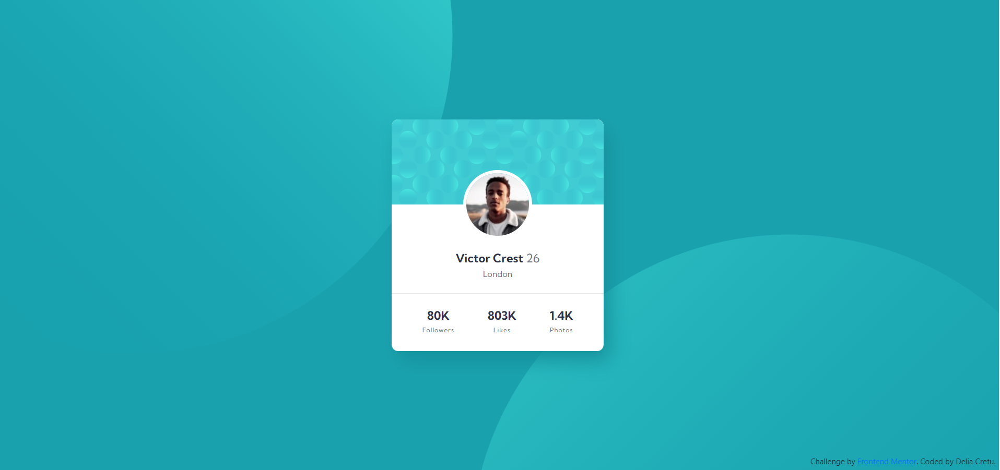

# Frontend Mentor - Profile card component solution

This is a solution to the [Profile card component challenge on Frontend Mentor](https://www.frontendmentor.io/challenges/profile-card-component-cfArpWshJ). Frontend Mentor challenges help you improve your coding skills by building realistic projects.

## Table of contents

- [Overview](#overview)
  - [The challenge](#the-challenge)
  - [Screenshot](#screenshot)
  - [Links](#links)
- [My process](#my-process)
  - [Built with](#built-with)
  - [What I learned](#what-i-learned)
  - [Continued development](#continued-development)

## Overview

### The challenge

Users should be able to:

- View the optimal layout depending on their device's screen size
- See hover and focus states for interactive elements

### Screenshot

Access here:


### Links

- Solution URL: https://github.com/delia-cretu/profile-card-component-main
- Live Site URL: https://delia-cretu.github.io/profile-card-component-main/

## My process

### Built with

- Semantic HTML5 markup
- CSS custom properties
- CSS Grid

### What I learned

I learned how to use several svg files in the body background using the attribute background-image and how to change their position using the attribute background-position:

```css
body {
  background-color: #19a2ae;
  background-image: url(images/bg-pattern-bottom.svg),
    url(images/bg-pattern-top.svg);
  background-position: 130% -140%, -50% 170%;
  background-repeat: no-repeat;
}
```

I figured out how to move the center of a div containing an image from the top-left corner to its actual center and position the image:

```css
.img-profile {
  transform: translate(-50%, -50%);
  position: absolute;
  left: 50%;
```

### Continued development

I continue to improve my knowledge of CSS Grid.
